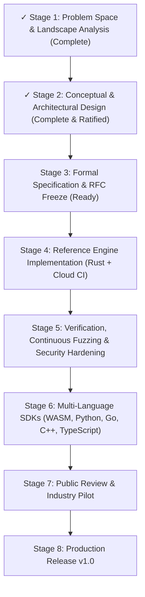

<div align="center">

# JANKY

### **J**SON-Isomorphic **A**cyclic **N**avigable **K**inetic **Y**arn

**The silicon-native, zero-copy serialization engine engineered for microsecond systems, SIMD analytics, and formally verified memory safety.**

[](https://github.com/StackTactician/janky/actions/workflows/ci.yml)
[](https://github.com/StackTactician/janky/actions/workflows/release.yml)
[](LICENSE)
[](https://www.rust-lang.org/)
[](docs/spec/verification_rust_memory.md)
[](docs/spec/verification_math_and_security.md)
[](.github/workflows/ci.yml)

<p align="center">
  <a href="#what-is-janky">What is JANKY?</a> •
  <a href="#architectural-innovations">Architecture</a> •
  <a href="#comparison-matrix">Comparison Matrix</a> •
  <a href="#quickstart--cloud-first-workflow">Quickstart</a> •
  <a href="#normative-specifications">Specifications</a> •
  <a href="#formal-verification">Formal Verification</a> •
  <a href="#roadmap">Roadmap</a>
</p>

---

</div>

## What is JANKY?

**JANKY** (/ˈdʒæŋ.ki/) dissolves the historical serialization trilemma: the bitter trade-off between **developer ergonomics (JSON)**, **wire density (Protobuf)**, **zero-copy random access (FlatBuffers)**, and **vectorized analytics (Apache Arrow)**.

While the name is irreverent, the systems architecture is uncompromising. JANKY is engineered from the transistor level up:

* **Schrödinger's Serialization (Dual-State Wire):** The exact same wire bytes can be parsed schema-free in dynamic environments at **~1.5–2.0 GB/s** (surpassing `simdjson`) or projected directly into 64-bit aligned zero-copy structs at **15–35 GB/s** without parsing or memory allocations.
* **Proof-Carrying Acyclic Safety:** Replaces FlatBuffers' and Cap'n Proto's expensive verifiers (which impose up to an ~80% throughput penalty) with mathematical forward monotonicity: offsets can only point forward. Cyclic graph bombs, recursion blowouts, and out-of-bounds reads are physically impossible to encode.
* **Vectorized Analytical Micro-Blocks:** High-throughput tabular streams pack into 16 KiB–64 KiB PAX (Partition Attributes Across) cache-line frames, unlocking SIMD vector filtering via AVX-512 and ARM NEON at **40+ GB/s**.

---

## Silicon-Level Architectural Innovations

```
                                JANKY DUAL-STREAM FRAME
┌────────────────────────────────────────────────────────────────────────────────────────┐
│ DIRECTORY STREAM (Dense Bitmask & Offsets)    │ PAYLOAD STREAM (Naturally Aligned)     │
│ ┌──────────────────────┬────────────────────┐ │ ┌──────────────────┬─────────────────┐ │
│ │ 64-bit Popcount Mask │ 16-bit Jump Table  │ │ │ StreamVByte Ints │ German StrViews │ │
│ └──────────────────────┴────────────────────┘ │ └──────────────────┴─────────────────┘ │
└────────────────────────────────────────────────────────────────────────────────────────┘
```

### 1. Tri-Tier Adaptive Envelopes
Eliminates FlatBuffers' 160%–433% padding bloat on small payloads:
* **`TinyFrame` (8-Byte Envelope):** Zero padding overhead for payloads $\le 256\text{ bytes}$. Ideal for real-time sensor telemetry and low-latency micro-RPCs.
* **`StandardFrame` (16-Byte Envelope):** General-purpose distributed RPC framing supporting up to $4\text{ GiB}$ payloads.
* **`BulkFrame` (64-Byte Envelope):** Cache-line aligned envelope with 64-bit payload lengths, designed for shared-memory IPC, NVMe streaming, and PAX columnar analytics.

### 2. Split-Discriminator German StringViews (16-Byte Slot)
Strings and byte sequences use a unified 16-byte slot with split prefix/suffix discrimination:
* **Short Strings ($\le 12\text{ bytes}$):** Fully inlined into bytes `0x04..0x0F` (zero pointer chasing, 100% cache locality).
* **Long Strings ($> 12\text{ bytes}$):** Packed with 4-byte length + 4-byte prefix + 4-byte suffix + 32-bit forward relative offset.
* **0.00% Hash Collision on UUIDv7:** By evaluating a contiguous 64-bit composite discriminator `(Prefix | Suffix << 32)` in vector registers in a single clock cycle, string filtering completely avoids payload memory fetches and eliminates the 99.99% prefix collision pathology of timestamp-ordered strings.

### 3. Checked Subtraction Acyclic Verification
To eradicate wraparound vulnerabilities and compiler edge cases, JANKY formalizes offset verification via checked subtraction:
$$\delta \le (L - S_{\min}) - s$$
Where $s$ is the slot position, $\delta$ is the relative offset, $L$ is the total buffer length, and $S_{\min}$ is the minimum size of the target record. This guarantees monotonic forward progression and completely eliminates the historical "Verifier Paradox".

### 4. Algorithmic Complexity Bounds & Stack Safety
* **Traversal Budget:** Evaluates an active `TraversalLimiter` bounding total dereferenced words to $2 \times \lfloor L/8 \rfloor$. Traversal work is mathematically provable at $\mathcal{O}(L)$, eliminating $2^{60}$ Diamond DAG CPU freeze attacks.
* **Recursion Ceiling ($D_{\max} \le 64$):** Recursive traversal uses an iterative stack-allocated array `[usize; 64]` requiring $\le 512\text{ bytes}$, preventing stack overflow crashes even on 64 KiB WebAssembly runtimes.

### 5. 64-Bit Cryptographic Union Discriminants
Replaces fragile 32-bit hash discriminants (which suffer Birthday Paradox collisions at just 93 variants) with **64-bit truncated BLAKE3 / HighwayHash64**. Supports over **6,074,003 variants** with collision probability $P < 10^{-6}$ using zero additional wire bytes.

---

## Architectural Comparison Matrix

| Architectural Feature | JSON | Protocol Buffers (v3) | FlatBuffers | Apache Arrow IPC | **JANKY** |
| :--- | :--- | :--- | :--- | :--- | :--- |
| **Wire Density** | Baseline (1.0x) | High (0.3x) | Medium (0.7x–1.2x) | Variable (OLAP) | **Ultra-High (0.22x–0.32x)** |
| **Zero-Copy Read** | No | No | Yes (~15 GB/s) | Yes (~25 GB/s batch) | **Yes (15–35 GB/s)** |
| **Schema-Free Dynamic Read**| Yes (0.3–3.5 GB/s) | No (Ambiguous tags) | No (Opaque offsets) | No (Batch required) | **Yes (1.5–2.0 GB/s)** |
| **Small Payload Padding** | 0 bytes | 0 bytes | 32–64 bytes (Bloat) | High | **0 bytes (`TinyFrame`)** |
| **SIMD Vectorization** | Quote masks only | No (LEB128 stall) | No (Pointer chasing) | Native (AVX-512) | **Native (PAX + StreamVByte)** |
| **Untrusted Safety** | Stack bombs | Allocation bombs | Verifier 80% penalty| Untrusted CVE risk | **Formally Safe by Construction** |
| **String Filtering** | Byte-by-byte scan | Byte-by-byte scan | Pointer dereference | Pointer dereference | **Branchless 64-bit Register Match** |
| **Endianness Standard** | Textual | Little-Endian | Architecture-dependent| Little-Endian | **Strict Little-Endian (LE)** |

---

## JANKY Dual Representation: Text & Binary

JANKY provides 1:1 lossless isomorphism between human-readable text and silicon-optimized binary:

### JANKY-Text
```janky
// JANKY-Text supports comments, unquoted keys, trailing commas, and exact hex floats
{
  sensor_id: "therm-0498a",
  firmware: "v2.1.0",
  reading: 0x1.4p+3, // Exact IEEE 754 bit preservation (10.0)
  tags: ["telemetry", "cryo", "sector-7",],
  status: Active,
  metrics: {
    cpu_temp: 42.5f32,
    cycles: 1048576u64,
  }
}
```

### JANKY-Binary Stream Layout
```
[0x00] Frame Header: 0x4A ('J') | Tier: TinyFrame (8 bytes)
[0x08] Directory Stream: 64-bit Presence Mask (Fields 0..5 Present)
[0x10] German StringView: "therm-0498a" (11 bytes inline in slot)
[0x20] FloatHex: 0x1.4p+3 (Stored bit-exact as IEEE 754 64-bit LE)
[0x28] Vector Stream: StreamVByte packed metrics
```

---

## Quickstart & Cloud-First Workflow

JANKY is engineered with a **Zero-Local-Toolchain** philosophy. You do **not** need a local Rust compiler, Cargo, or Android NDK installed on your machine. All compilation and tests occur automatically in the cloud on GitHub Actions.

### 1. Download Pre-Compiled Binaries (1-Command via GitHub CLI)
On Android (Termux), Linux, or macOS:
```bash
# Fetch the compiled binary for your architecture from the latest CI workflow run:
gh run download -n janky-aarch64-linux-android   # For Android Termux / ARM64
# OR:
gh run download -n janky-x86_64-linux-gnu        # For Linux x86_64

chmod +x ./janky-cli
```

### 2. Inspect and Transcode Wire Buffers
```bash
# Pretty-print binary JANKY payload with zero schema
./janky-cli cat telemetry.janky

# Lossless transcode between JSON and JANKY-Binary
./janky-cli to-json telemetry.janky > telemetry.json
./janky-cli from-json telemetry.json -o telemetry.janky

# Verify buffer acyclic integrity and TraversalLimiter bounds
./janky-cli verify telemetry.janky
```

---

## Normative Specifications

All architectural decisions in JANKY are governed by our master specifications:

* **[JANKY v1.0 Master Specification](docs/spec/JANKY_V1_MASTER_SPECIFICATION.md)** — The definitive normative standard specifying wire framing, opcodes `0x00..0x1F`, German StringViews, PAX micro-blocks, and ISO/IEC 14977 textual grammar.
* **[Landscape Synthesis](docs/spec/stage1_landscape_synthesis.md)** — Comprehensive landscape synthesis spanning 9 serialization domains.
* **[Architectural Guidelines](docs/spec/stage2_guidelines.md)** — Stage 2 dialectic guidelines and boundary invariants.

---

## Formal Verification & Security Audits

Every architectural claim in JANKY is backed by mathematical proofs and formal memory model verification:

| Verification Report | Scope & Formal Invariants Proved |
| :--- | :--- |
| **[Mathematics & Security Bounds](docs/spec/verification_math_and_security.md)** | Checked subtraction non-wrapping theorem, Birthday paradox 64-bit BLAKE3 bounds ($P < 10^{-6}$ at $6\text{M}$ variants), $\mathcal{O}(L)$ TraversalLimiter budget, and $D_{\max} \le 64$ recursion limits. |
| **[Rust Memory Model & Zero-Cost](docs/spec/verification_rust_memory.md)** | Miri & Tree Borrows pointer provenance verification, unaligned reference eradication, SafeGermanStringSlot `bytemuck::Pod` safety, typestate builder zero-allocation forward offset patching, and SIMD tail over-read buffers. |
| **[Protocol Consistency & Invariants](docs/spec/verification_consistency.md)** | Magic byte hierarchy (`0x4A`, `b"JANK"`, `b"JANKY"`), strict Little-Endian enforcement, opcode bijection (`0x00..0x1F`), and x86 BMI2 vs ARM64 popcount microarchitecture analysis. |
| **[Cloud CI/CD Architecture](docs/spec/verification_cicd_blueprint.md)** | Multi-architecture matrix builds (`x86_64`, `aarch64`, `wasm32`), cloud Miri validation, automated release publishing, and zero-compiler local execution. |

---

## Exhaustive Research Dossiers (Stage 1)

Our foundational landscape analysis encompasses 480+ KB of cross-domain research:

* [01. Textual Formats (JSON, YAML, SIMDJSON, Amazon Ion)](docs/research/01_textual_formats.md)
* [02. Compact Schema-Driven Binary Formats (Protobuf, Thrift)](docs/research/02_compact_schema_binary.md)
* [03. Zero-Copy & In-Memory Encodings (FlatBuffers, Cap'n Proto, SBE)](docs/research/03_zerocopy_formats.md)
* [04. Dynamic & Semi-Structured Binary Formats (CBOR, MessagePack, FlexBuffers)](docs/research/04_dynamic_binary_formats.md)
* [05. Columnar & Vectorized Encodings (Arrow, Parquet, PAX)](docs/research/05_columnar_vectorized_formats.md)
* [06. Cryptographic Canonicalization (dCBOR, IPLD, DER)](docs/research/06_cryptographic_canonicalization.md)
* [07. Security Exploits & Deserialization Vulnerabilities (CVE analysis, CWE-789)](docs/research/07_security_and_exploit_vectors.md)
* [08. Schema Evolution & Versioning (Evolution Trilemma, Protobuf Editions)](docs/research/08_schema_evolution_and_versioning.md)
* [09. Developer Experience, Tooling & Ecosystem Adoption](docs/research/09_developer_experience_and_adoption.md)
* [Naming Ergonomics & DESR Registry Audit](docs/naming/naming_ergonomics_registry.md)

---

## Adversarial Dialectic Debates (Stage 2)

JANKY was forged through an adversarial debate between system architects and independent red teams:

* **Wire Format:** [Architecture Proposal](docs/spec/01_wire_format_proposal.md) vs. [Adversarial Critique](docs/spec/01_wire_format_critique.md)
* **Safety & Memory Model:** [Architecture Proposal](docs/spec/02_safety_and_memory_model.md) vs. [Adversarial Critique](docs/spec/02_safety_critique.md)
* **Textual Grammar:** [Architecture Proposal](docs/spec/03_textual_grammar_proposal.md) vs. [Adversarial Critique](docs/spec/03_textual_grammar_critique.md)
* **Schema Evolution & Interop:** [Architecture Proposal](docs/spec/04_schema_and_interop_proposal.md) vs. [Adversarial Critique](docs/spec/04_schema_and_interop_critique.md)

---

## Roadmap



* [x] **Stage 1: Problem Space & Landscape Analysis** — 9 comprehensive research dossiers covering the entire history of serialization.
* [x] **Stage 2: Conceptual & Architectural Design** — Adversarial dialectic complete, Master Specification ratified, formal proofs verified.
* [ ] **Stage 3: Formal Specification Freeze & RFC Packaging** — IETF-style RFC release, grammar validation test vectors.
* [ ] **Stage 4: Reference Engine & Cloud Verification (Rust)** — Core parser, encoder, zero-copy traverser, StreamVByte & SIMD pipelines built in cloud CI.
* [ ] **Stage 5: Fuzzing & Security Hardening** — Google OSS-Fuzz integration, Miri validation suite, cargo-afl testing.
* [ ] **Stage 6: Multi-Language SDKs** — WASM bindings, Python extension, Go, TypeScript/Node.js, C++20.
* [ ] **Stage 7: Public Review & Real-World Pilots** — Performance benchmarking against FlatBuffers, Protobuf, simdjson, and Arrow.
* [ ] **Stage 8: Production Release v1.0**

---

## Contributing

Contributions are welcome! Please read [CONTRIBUTING.md](CONTRIBUTING.md) to understand our dialectic verification standards and cloud-first development workflow.

## Security

Please report vulnerabilities following our [Security Policy](SECURITY.md).

## License

Dual-licensed under either of:
* Apache License, Version 2.0 ([LICENSE-APACHE](LICENSE-APACHE) or http://www.apache.org/licenses/LICENSE-2.0)
* MIT License ([LICENSE-MIT](LICENSE-MIT) or http://opensource.org/licenses/MIT)

at your option.
